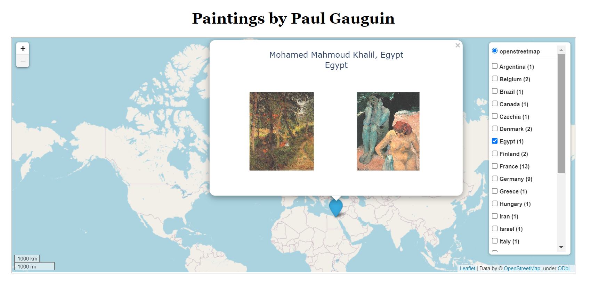
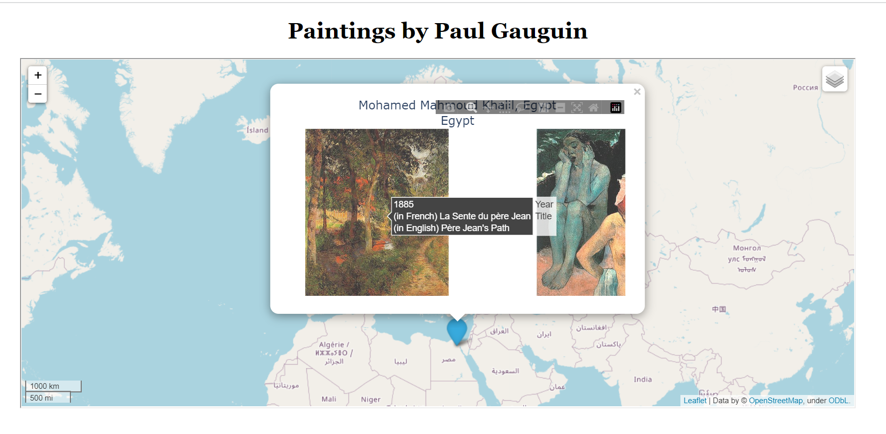

#  App dedicated to Paul Gauguin paintings
Powered by pandas-plotly-folium-flask stack, this app will allow user to examine
data scrapped from https://en.wikipedia.org/wiki/List_of_paintings_by_Paul_Gauguin
in conveniet mode. Thus, one can virtually visit museums/galleries on worldmap and
enjoy masterpieces created by Paul Gauguin.




On worldmap one can choose country from drop-down list and visit the collection
using zoom/pan facilities delivered by Plotly graphing library. 

The app can be run as docker container (tested on localhost) based only on 
pre-processed data (coordinates excel sheet and plotly html-data):

```
docker-compose up
```

dir /data_scrapping contains scripts and data needed to reproduce all
data scrapping and processing from scratch (see wikipedia source).